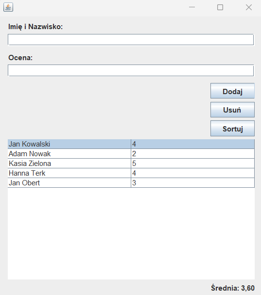
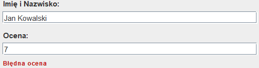
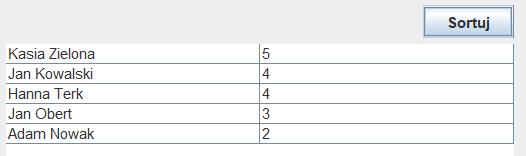
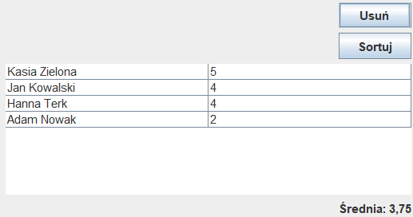

# Grade Journal ✅
Window based application that allows you to save school grades. The application allows to add a new grade or delete it for a student. It has safeguards regarding the assessment format and student name. Each time a grade is added, the grade average in the journal is recalculated. It is possible to sort the list by grades in descending order. Java and Swing were used to create this application.

  

* After adding some grades:

  

* Validators:

  

* List of grades after using the sort button:

  

* List of grades after using the delete button, the average has changed:

  

